

<h1>P1集合的基本概念</h1>
集合：由确定的对象（客体）构成的集体 
# "确定" ：论域内的任何客体，是否属于这个集体是确定的 
 
元素：集合中的对象（集合的元素可以是集合） 
∈表示属于关系 
例：2∈N，¬（1.5∈N），1.5∉N 
 
集合的表示方法： 
1.列举法：N={1，2，3，4……} 
2.描述法：B={x | x是偶数且 2 < x < 13 } 
# A={x|P（x）}，其中x是谓词公式，如果论域内客体a使P（a）为真，则a∈A，否则a∉A 
 
集合的性质：1.无序性2.互异性 
常用集合：自然数集N，整数集I，实数集R，有理数集Q 
 
 

<h1>P2集合的关系</h1>
包含： 
A集合的元素都是B集合中的元素，则B包含A，A包含于B，A是B的子集， 
A⊆B⇔∀x（x∈A→x∈B） 
 

性质： 
1.自反性：A⊆A  
2.传递性：A⊆B，B⊆C，则A⊆C  
3.反对称性：A、B互相包含，则A=B 

 
相等： 
	A、B的元素完全相同，则A、B相等 
A=B ⇔ A⊆B∧B⊆A ⇔ ∀x（x∈A↔x∈B） 
性质：1.自反性：A=A 2.传递性：A=B，B=C，则A=C 3.对称性：A=B，B=A 
 
真包含：A⊆B且A≠B，则B真包含A，A是B的真子集， 
A⊂B ⇔ A⊆B∧A≠B ⇔ ∀x（x∈A→x∈B）∧∃x（x∈B∧x∉A） 
性质: 传递性 
 

<h1>P3特殊集合</h1>
全集E（论域）：包含所讨论的所有集合的集合 
全集不唯一，讨论不同问题时全集不同 
E={x | P（x）∨¬P（x）} 
 
空集Φ：没有元素的集合 
Φ={x | P（x）∧¬P（x）} 
空集是任何集合的子集，空集是唯一的 
 

<h1>P4集合的运算</h1>
<ul>
<li>
交：既属于A又属于B的集合 
 
A∩B={x | x∈A∧x∈B}	 x∈A∩B ⇔ x∈A∧x∈B 
如果A∩B=Φ，则A、B不相交 
 
性质： 
1.幂等律：A∩A=A  
2.交换律：A∩B=B∩A  
3.结合律：（A∩B）∩C=A∩（B∩C） 
4.同一律：A∩E=A 
5.零律：A∩Φ=Φ  
6.A⊆B⇔A∩B=A 
 
</li>
<li>
并：属于A或者属于B的集合 
 
A∪B={x|x∈A∨x∈B}	 x∈A∪B ⇔ x∈A∨x∈B 
分配律：A∩（B∪C）=（A∩B）∪（A∩C）、 
吸收律：A∪（A∩B）=A 、  
# A∪（A∩B）=（A∩E）∪（A∩B）=A∩（E∪B）=A∩E=A 
# A⊆B⇔A∪B=B 
 
</li>
<li>
差：属于A而不属于B的集合，A与B的差集，B对A的相对补集 
	A-B={x|x∈A∧x∉B}   x∈A-B⇔x∈A∧x∉B 
 
1.A-Φ=A	  
2.Φ-A=Φ  
3.A-A=Φ	 
4.A-B⊆A	 
5.A⊆B⇔A-B=Φ   
6.（A-B）-C=（A-C）-（B-C） 
7. A-（B∩C）=（A-B）∪（A-C） 
8. A-(B∪C)=（A-B）∩（A-C） 
9. A∩（B-C）=（A∩B）-（A∩C）#交∩对-是可分配的，并∪对-是不可分配的 

    9证明:任取x∈（A∩B）-（A∩C） 
    ⇔x∈（A∩B）∧x∉（A∩C） 
    ⇔（x∈A∧x∈B）∧¬（x∈A∧x∈C） 
    ⇔（x∈A∧x∈B）∧（x∉A∨x∉C） 
    ⇔（x∈A∧x∈B∧x∉A）∨（x∈A∧x∈B∧x∉C） 
    ⇔x∈A∧x∈B∧x∉C 
    ⇔x∈A∧x∉B-C 
    ⇔x∈A∩（B-C） 

</li>
<li>
对称差： 
只属于A或者只属于B的元素的集合 
A⊕B=(A∪B)−(A∩B) 
</li>
<li>
补集： 
	~A,不属于A的元素组成的集合 </li>
</ul>

<h1>P5有穷集的计数问题</h1>
文氏图法： 
1.根据条件构建文氏图  
2.填充已知区域的元素数，未知区域用变量表示  
3.对未知变量列方程组 
例： 
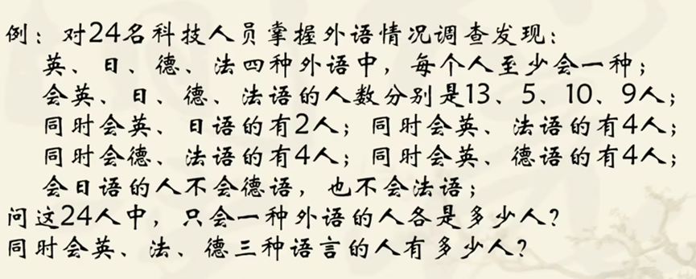
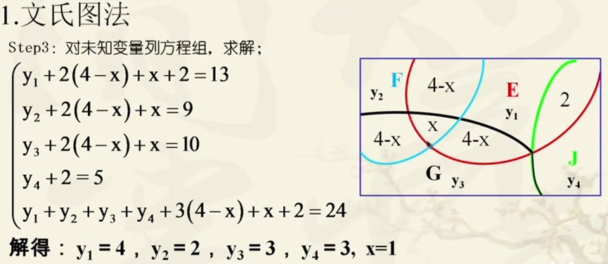
  
  
容斥定理： 
|A∪B|=|A|+|B|-|A∩B|	&nbsp;&nbsp;&nbsp;// 其中|A|表示A的元素数量 
 
|A∪B∪C| = |A∪B|+|C| - |（A∪B）∩ C | 
=|A|+|B| - |A∩B|+|C| - （|A∩C|+|B∩C| - |A∩B∩C|） 
=|A|+|B| +|C|- |A∩B| - |A∩C| - |B∩C|+|A∩B∩C|） 
 
|A1∪A2∪...∪An| 
=∑|Ai|  # i = 1 → n   
-∑|Ai∩Aj| # 1 ≤ i < j ≤ n 
+∑|Ai∩Aj∩Ak| (# 1 ≤ i < j < k ≤ n 
+...+（-1）^(n-1) |A1∩A2∩...∩An| 
 
 

<h1>P6序偶与集合的笛卡尔积</h1>
序偶（有序二元组）： 
由两个对象x、y组成的序列，记作 < x，y > 
其中称x、y为序偶 < x ，y >的第一、第二元素 
两个序偶对应元素相等，则序偶相等 
 
有序元组： 
有序3元组是序偶，其第一个元素是序偶 < < a，b > ，c > 可简写为 < a，b，c > 
有序n元组：第一个元素是n-1元组 < < x1，x2，...，xn-1 >，xn >简写为 < x1，x2，...，xn > 
有序n元组相等：对应元素都相等 
 
笛卡尔积： 
由A的元素为第一元素，B的元素为第二元素组成的全部序偶集合，记作A×B 
例：A×B={ < x，y > | x∈A∧y∈B} 不满足交换律、不满足结合律 
（A×B）×C={ < < a，b >，c > | < a，b >∈A×B ∧ c∈C} 
 
性质： 
（1）有限集|A×B|=|A|×|B|=mn 
（2）A×Φ=Φ×B=Φ 
（3）×对∩和∪满足分配律：A×（B∪C）=（A×B）∪（A×C） 
（4）若C≠Φ，则A⊆B ⇔ A×C⊆B×C ⇔ C×A⊆C×B 
（5）若非空集合A、B、C、D，则A×B⊆C×D ⇔ A⊆C∧B⊆D 
（6）（A1×A2）×A3=A1×A2×A3 
A1=A2=...=An，则A1×A2×...×An=A^n 
 
笛卡尔积的运用： 
（1）数据库:A1={姓名} 
（2）字母表：A={a~z}，data < d，a，t，a>有序4元组 A^4 
 
关系的集合运算： 
例：A={学生}，R是A上的同乡关系，S是A上的同姓关系 
则R∪S：或同乡或同姓关系；R∩S：同乡且同姓关系； 
R-S：同乡而不同姓关系；~R：不同乡关系（~R=(A×A)-R）； 
R⊕S：同乡不同姓或同姓不同乡关系 

 

<h1>P7二元关系及其表示法</h1>
相关： 
按照某种规则，确认两个或多个对象有关系，则为相关 
例：A={a~z}，B={1~26} 
可建立关系R1={ < a，1 > ，< b，2 >...} ⊆ A×B  
 
定义1：如果R⊆A×B，则R是一个从A到B的二元关系。如果R⊆A×A，则R是A上的二元关系 
定义2：任何序偶集合都是一个二元关系 
 
x与y有R关系: < x，y > ∈ R # 后缀表示 ⇔ xRy #中缀表示 
 
定义域（domain）：R⊆A×B，由< x，y>∈R的第一元素组成的集合为R的定义域 
dom（R）={x | ∃y（< x，y>∈R）} 
 
值域（range）：R⊆A×B，由< x，y>∈R的第二元素组成的集合为R的定义域 
ran（R）={y | ∃x（< x，y>∈R）} 
 
关系的表示方法： 
1.枚举法 R={<1，1>，<1，2>} 
2.谓词公式法 R={< x，y> | x < y} 
3.有向图法（关系图） 
用两组小圆圈（结点）分别表示A和B的元素，当< x，y>∈R是，从x到y引一条有向弧（边） 
4.矩阵表示法 
A={ai}，B={bi}，R⊆A×B，定义R的m×n阶矩阵MR=(rij)m×n，其中rij=1 if < ai，bj >∈R else 0 # 1≤i≤m，1≤j≤n 
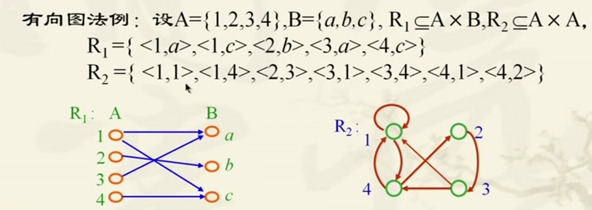
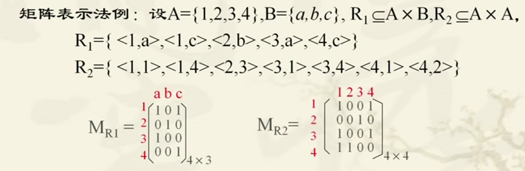
 
 
特殊关系： 
空关系： 
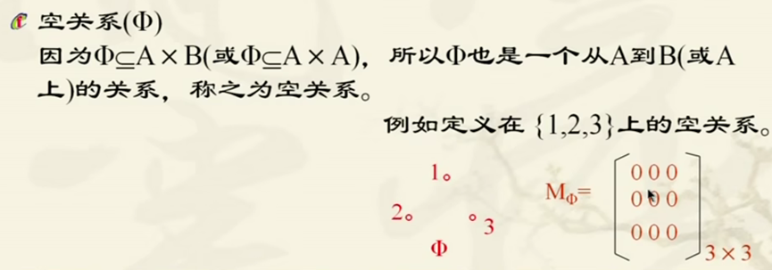
 
 
完全关系（全域关系）： 
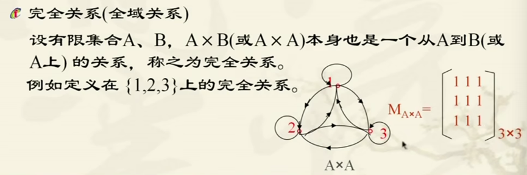
 
恒等关系： 
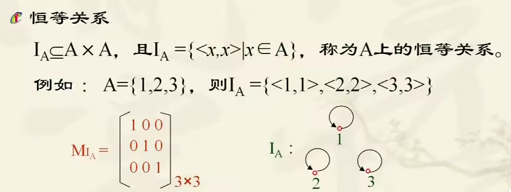
 
 

<h1>P8关系的性质</h1>
（R⊆A×A） 
<ul>
<li>
自反性： 
如果对于任意x∈A都有< x，x >∈R（xRx），则R是A中的自反关系 
R是A中的自反关系⇔∀x（x∈A→xRx） 
 
例：“≤”是一种自反关系，任意实数x都有x≤x 
特点：关系有向图每个结点都有环，关系矩阵主对角线都为1 
 
</li>
<li>
反自反性： 
如果对于任意x∈A都有< x，x>∉R，则R是A中的反自反关系 
R是A中的反自反关系⇔∀x（x∈A→< x，x>∉R） 
 
例：“＜” 
特点：关系有向图每个结点都没有环，关系矩阵主对角线都为0 
注意：一个不是自反的关系，不一定就是反自反的，反之亦然 
 
</li>
<li>
对称性： 
若对于任意x，y∈A，如果有xRy，必有yRx，则R为A中的对称关系 
R为A中的对称关系⇔∀x∀y（（x∈A∧y∈A∧xRy）→yRx） 
 
例：邻居关系、朋友关系 
特点：关系有向图两个结点如果有边，则有方向相反的两条边，关系矩阵沿主对角线对称 
 
</li>
<li>
反对称性： 
若对于任意x，y∈A，如果有xRy和yRx，则有x=y，则R为A中的反对称关系 
R为A中的反对称关系 ⇔ ∀x∀y（（x∈A∧y∈A∧xRy∧yRx）→x=y） 
⇔ ∀x∀y（（x∈A∧y∈A∧xRy∧x≠y）→ < y，x >∉R） 
 
例：“≤” 
特点：关系有向图两个结点最多有一条边，关系矩阵沿主对角线对称的两个元素最多有一个1 
注意：对称与反对称不是对立的，有些关系既是对称也是反对称，如空关系、恒等关系 
</li>
<li>
传递性： 
对任意x，y，z∈A，如果有xRy和yRz，就有xRz，则R为A中的传递关系 
R为A中的传递关系⇔∀x∀y∀z（（x∈A∧y∈A∧z∈A∧xRy∧yRz）→xRz） 
 
例：“＜”、“≤”、“⊆”等是传递的 
不易看清是否有传递性，需要通过定义判断 
注意：传递性定义的谓词公式形式的前件为F时，整个表达式为T，传递性成立，即若xRy与yRz中至少有一个是F时，前件为假，R是传递的 
独立结点不影响传递性：空关系和恒等关系是传递的 
</li>
</ul>
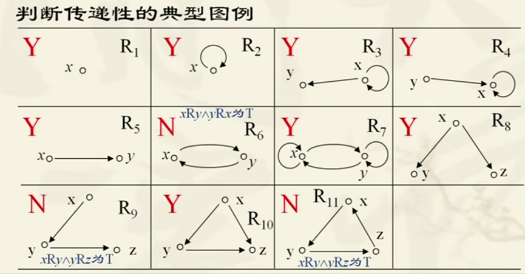

<h1>P9关系的复合运算</h1>
定义：设R是从X到Y的关系，S是从Y到Z的关系，则复合关系R°S是X到Z的关系 
R°S={ < x，z> | x∈X∧z∈Z∧∃y（y∈Y∧< x，y>∈R ∧< y，z>∈S）} 
 
例：a，b，c三人，A={a，b，c}，R是A上的兄妹关系，S是A上的母子关系，已知 < a，b>∈R∧< b，c>∈S，即 
a是b的哥哥，b是a的妹妹 a→R→b→S→c 
b是c的母亲，c是b的儿子 a→R °S→c 
则a，c就是舅舅和外甥的关系，记作R°S，称为R和S的复合 
 
关系复合的计算方法： 
有向图法： 
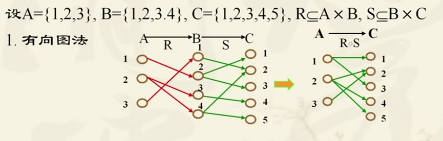
（过河拆桥法）
 
 
枚举法： 
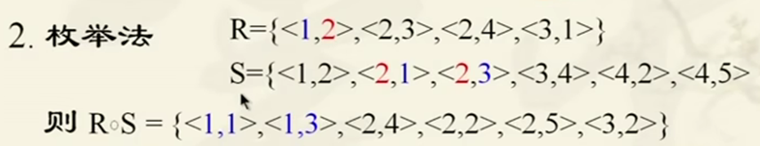
 
 
谓词公式法： 
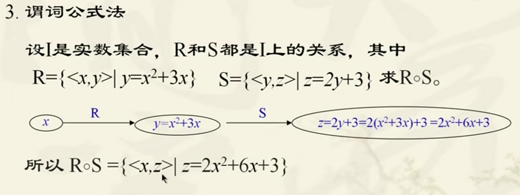
 
（复合函数代入法） 
 
 
关系复合运算的性质： 
不满足交换律，例：R={<1,a>},S={ < a,2 >},R°S={<1,2>},S°R=Φ 
1.结合律：已知R⊆A×B，S⊆B×C，T⊆C×D,则R°（S°T）=（R°S）°T 
2.已知R⊆A×B，S⊆B×C，T⊆B×C，则 
（1）R°（S∪T）=（R°S）∪（R°T） 
（2）R°（S∩T）⊆（R°S）∩（R°T） 
3.R是A到B的关系，则R°IB=IA°R=R 
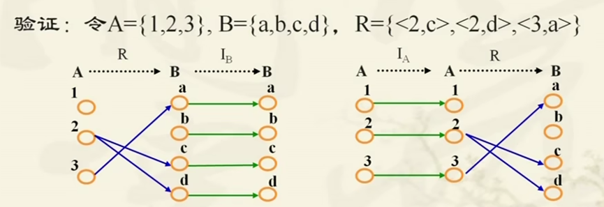
 
4.关系的乘幂：R是A上的关系，则R°R=R^2... 
R°R°...°R=R^n 特别的R^0=IA 
R^m ° R^n=R^(m+n)        (R^m)^n=R^mn 其中m、n非负 
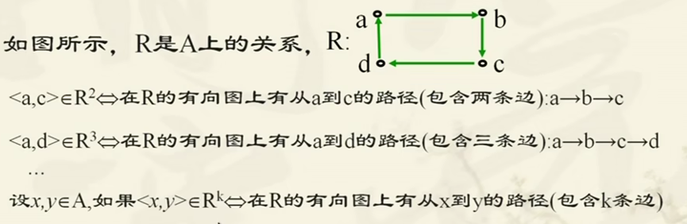
  
 

<h1>P10关系的求逆运算</h1>
定义：从A到B的关系，序偶位置互换，得到从B到A的逆关系R^-1 写作Rc 
< y,x >∈R^c ⇔ < x,y >∈R 
Rc有向图所有边的方向调转，关系矩阵转置 
 
公式: 
1.（Rc）c=R     
2.（R∪S）c=Rc∪Sc 
3.（R∩S）c=Rc∩Sc 
4.（R-S）c=Rc-Sc 
5. R⊆S⇔Rc⊆Sc 
6.~Rc=(~R)c 
7.设R⊆X×Y，S⊆Y×Z，则（R°S）c=Sc°Rc 
8. 设R是A上的关系，则R是对称的，当且仅当Rc=R （转置） 
 

<h1>P11关系的闭包运算</h1>
复合与求逆构成一个新的关系 
 
<ul>
<li>
自反闭包： 
定义：给定A中的关系R，若A上另一个关系R’,满足： 
(1)R⊆R’ 
(2)R’是自反的 
（3）R’是最小的(包含序偶最少)，对于任何A上自反关系R’’，如果R⊆R’’，都有R’⊆R’’ 
则R’是R的自反闭包，记作r（R） 
</li>
<li>
对称闭包：如果R’是包含R的最小对称关系，则为对称闭包，记作s（R） 
<li>
传递闭包：如果R’是包含R的最小传递关系，则为传递闭包，记作t（R） 
</li>
求自反闭包，只需要加最少的序偶使新关系自反即可，其余类似 
</ul>
 
定理：r（R）=R ∪ IA     
s（R）=R∪Rc         
t（R）=R∪R^2∪R^3... (在i≥某数时会有R^i=R^（i-1）) 
 
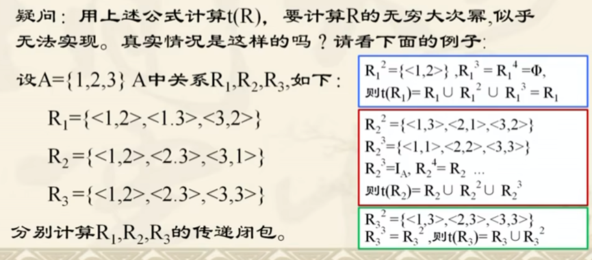
 
若|A|=n t（R）=R∪R2∪...∪Rn n个元素路径长就为n 
 

<h1>P12集合的划分与覆盖</h1>
覆盖： 
A={A1,A2,...,An},Ai≠Φ，Ai⊆X，如果A1∪...∪An=X，则A为非空集合X的一个覆盖 
 
划分： 
设A为X的一个覆盖，且Ai∩Aj=Φ，则A为X的划分，每个Ai均称为这个划分的一个划分类 
 
划分一定是覆盖，覆盖不一定是划分 
 
最小划分：只有一个划分块的划分，这个划分块就是X本身 A={{X}} 
 
最大划分：每个划分块里只有一个元素的划分 A={{X1}，{X2}，...，{Xn}} 
 
交叉划分： 
例：X为人，A、B是X的划分，A={男，女}，B={成年，未成年}，得到C={男成年，女成年，男未成年，女未成年}，显然C也是X的划分 
定义：A={A1，...，Am}，B={B1，...，Bn}，所有Ai∩Bj组成的集合C是A与B两种划分的交叉划分 
 

<h1>P13等价关系与等价类</h1>
定义： 
若A上的关系R是自反的、对称的、传递的，则R是A上的等价关系 
若a，b∈A， R是等价关系，且aRb，则a与b等价 
 
例：A={1，2,3,4,5,6,7}，R是A上的模3同余关系， 
即R={ < x,y >|x/3与y/3余数相同} 
 
等价关系的有向图： 
由若干个独立子图构成，每个独立子图都是完全关系图 
完全关系图：集合A上的完全关系A×A，每个结点都有环，任意两个结点都有双向边 
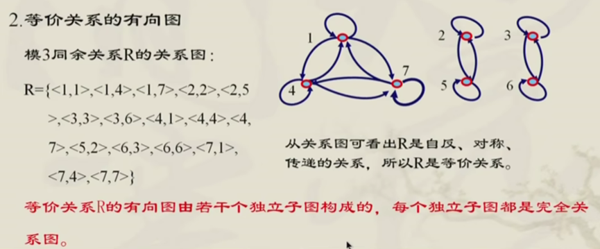
 
等价类： 
R是A上的等价关系，a∈A，由a确定的集合[a]R={x | x∈A 且 < a,x > ∈R} 
则[a]R为由a形成的R等价类，简称a等价类 
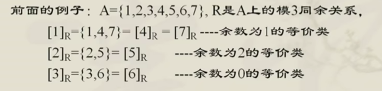
 
等价关系图求等价类： 
每个独立子图上的结点构成一个等价类，独立子图个数=不同的等价类个数 
 
等价类性质： 
（1）R是·A上的等价关系，∀a∈A，若x，y∈[a]R，必有 < x,y >∈R 
同一个等价类中的元素，彼此有等价关系 < a,x>对称 < x,a>,加 < a,y>传递 < x,y > 
（2）∀a，b∈A，[a]R∩[b]R=Φ，当且仅当 < a,b > ∉R 
（3）[a]R=[b]R，当且仅当 < a,b > ∈R 
（4）∀a∈A，a属于且仅属于一个关于R的等价类（相同等价类是一个等价类） 
（5）任意两个等价类要么相等要么不相交 
（6）由R的所有等价类构成的集合是A的一个划分（这个划分称为商集） 
 
商集： 
由R的所有等价类构成的集合是A的一个划分，A关于R的商集 
A/R={ [a]R | a∈A } 
 
性质: 
（1）A/R的任意元素[a]R⊆A 
（2）商集的两个不同元素不相交 
（3）因为A中的每个元素都属于一个等价类，所以所有等价类的并集（等于A A的一个覆盖） 
由划分确定等价关系： 
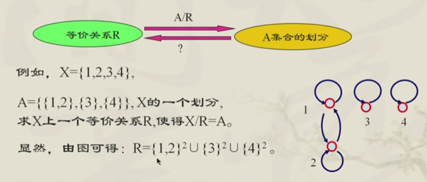
 
A={A1，A2，...，An}是X的一个划分，则可以构造一个X上的等价关系，使X/R=A 构造方法：R=A1^2∪...∪An^2 其中Ai^2=Ai×Ai  
#笛卡尔积：A×B={< x，y> | x∈A∧y∈B}      
 

<h1>P14相容关系与相容类</h1>
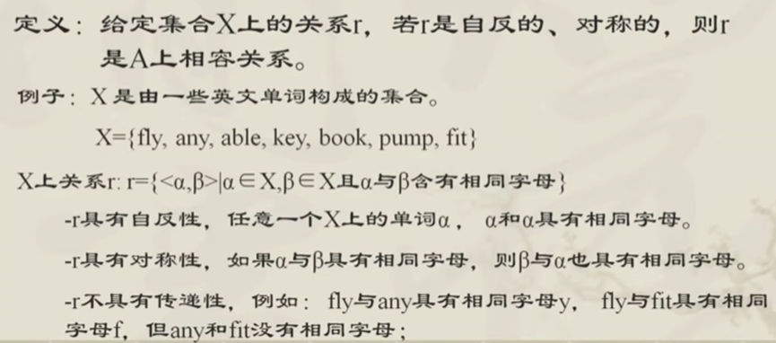
 
关系图：每个结点都有环，两个结点如果右边，一定是成对的边 
关系图简化：不画环，两条对称边用一条无向直线代替 
关系矩阵：主对角线都是1，沿主对角线对称 
矩阵简化：用下三角代替（不含主对角线） 
相容类： 
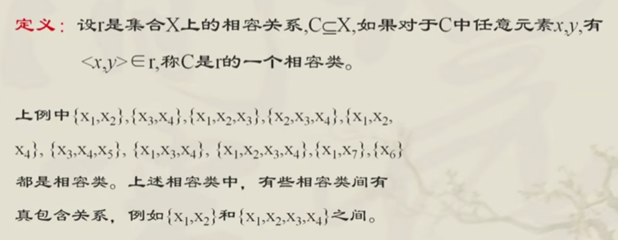
 
最大相容类： 
（线性代数极大无关组？） 
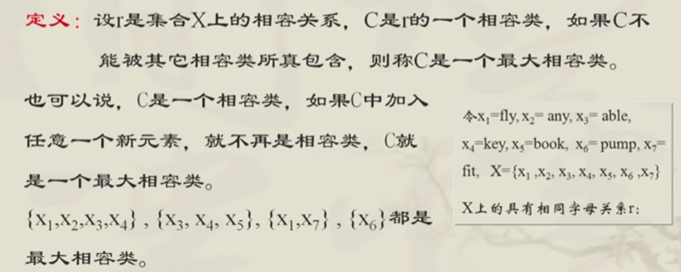
 
求最大相容类： 
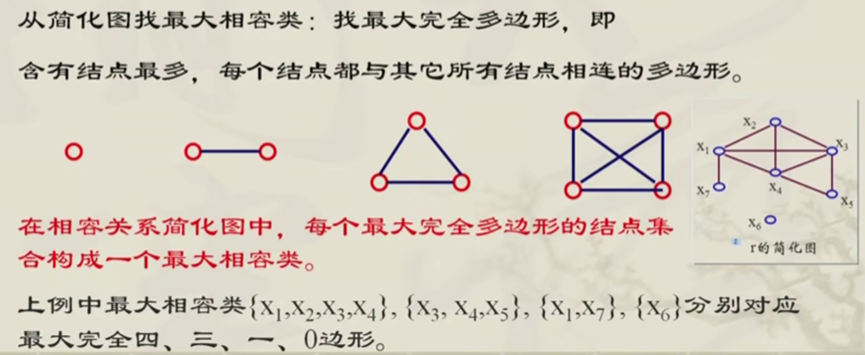
 
完全覆盖： 
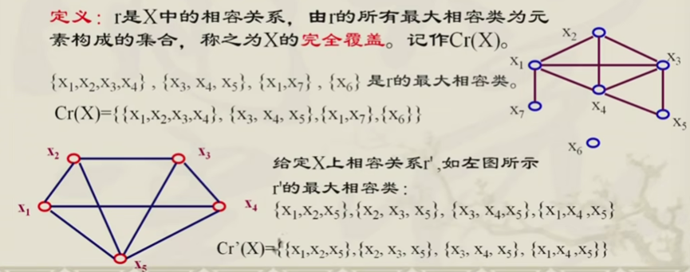
 

<h1>P15偏序关系</h1>
偏序集： 
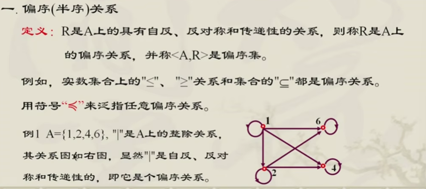
 
该符号读作“先于等于” 
特点：每个结点都有环（自反） #省略环不画 
两个结点之间最多有一条边（反对称） #左下指向右上↗ 
如果有 < a,b > ∈ R ∧ < b,c > ∈ R ，则 < a,c > ∈ R（传递） # 省略不画 
Hasse图： 
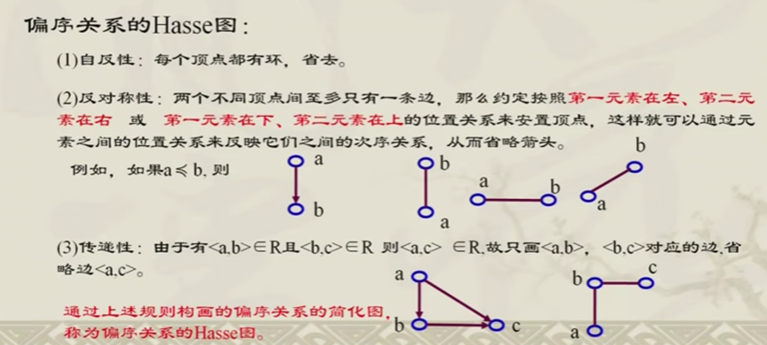
 
 
全序关系： 
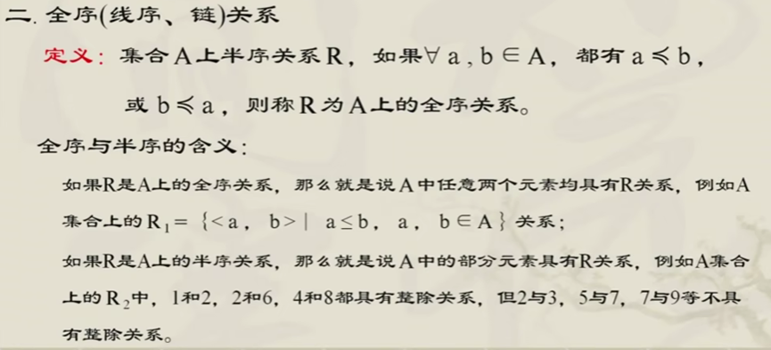
 
 
偏序集重要元素： 
1.极大元与极小元： 
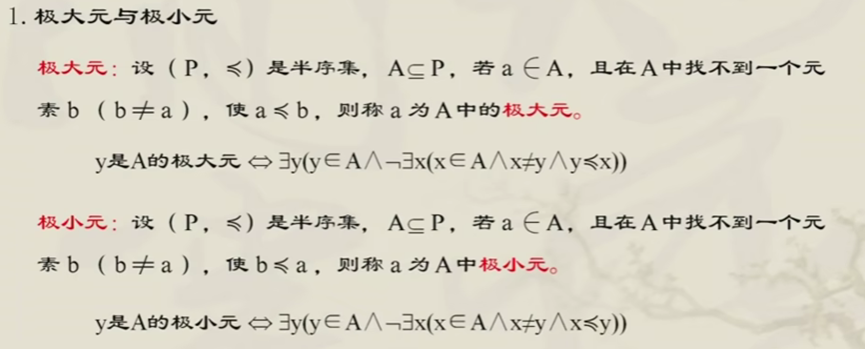
 
注意：A的极大元与极小元要在A（子集）中寻找，不要到P（全集）中寻找 
极大元唯一时为最大元 
例： 
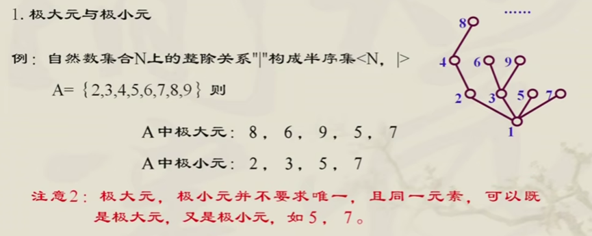
（函数最值与极值？） 
2.最大元与最小元： 
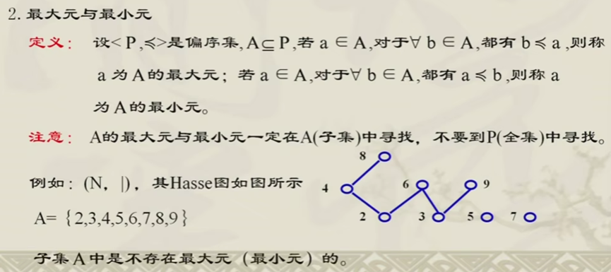
 
唯一性定理： 
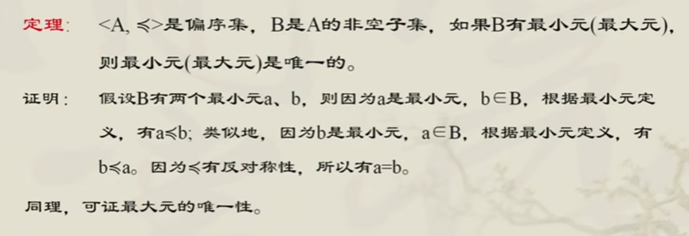
 
上界与下界： 
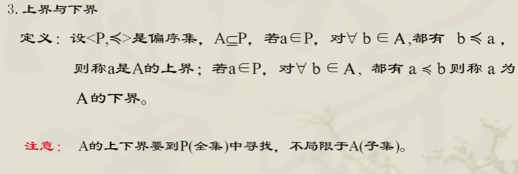
 
例： 
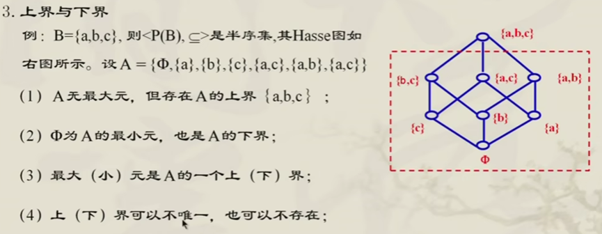
 
上确界与下确界： 
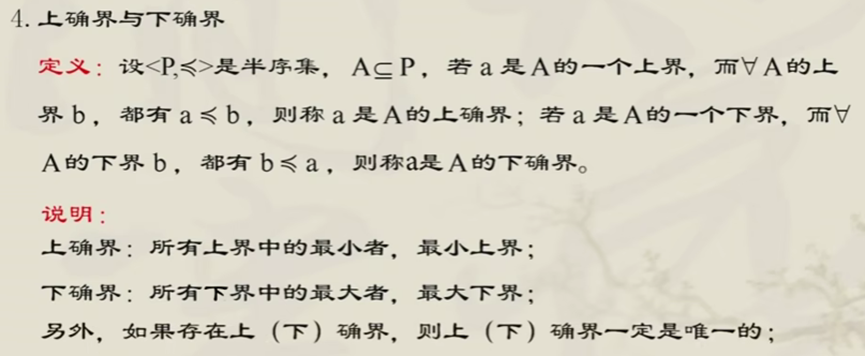
 

