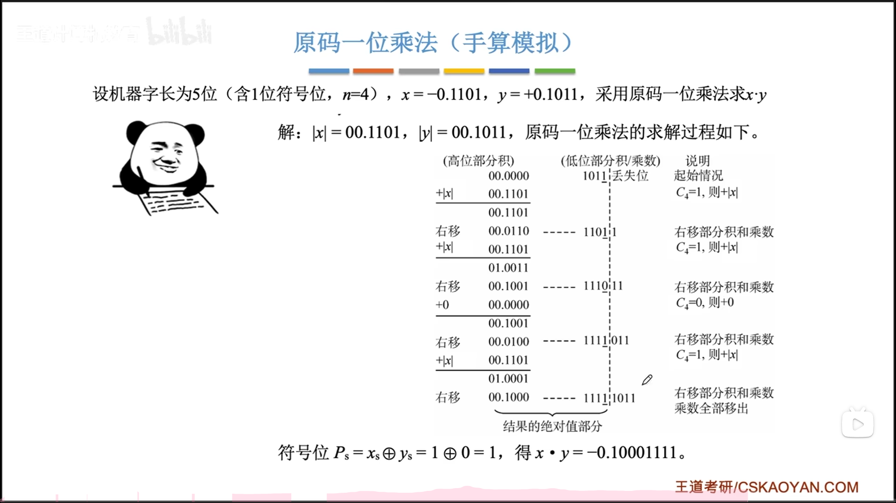
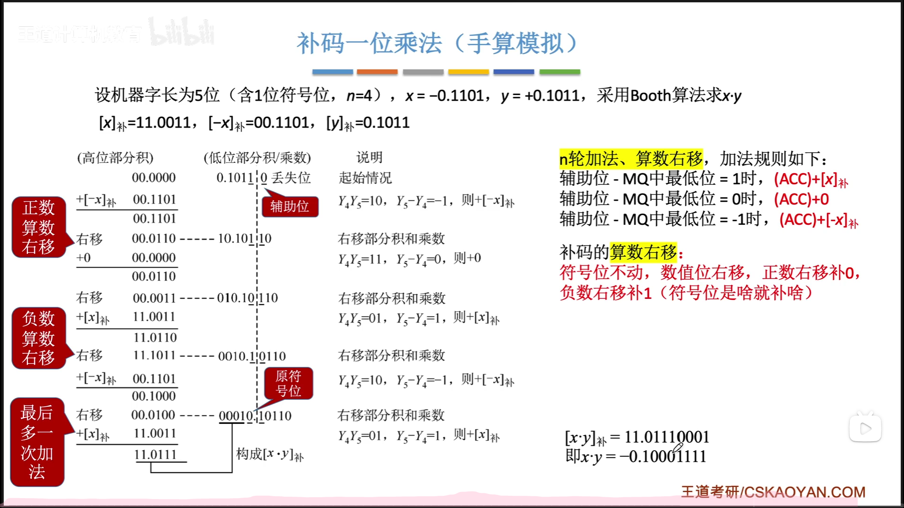
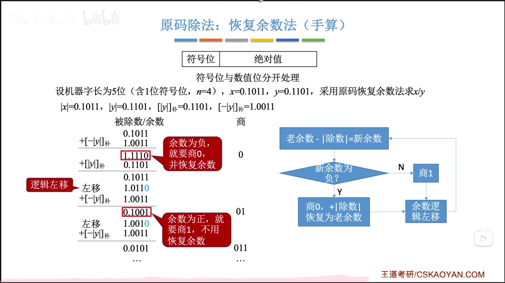
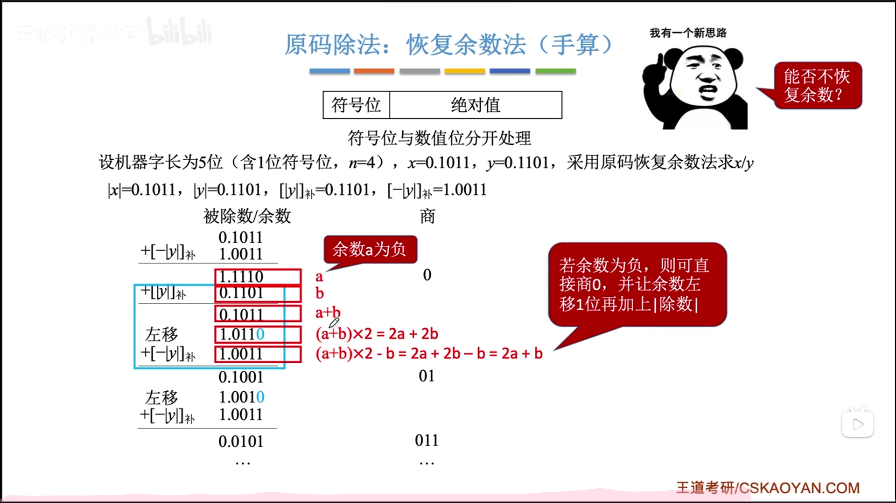
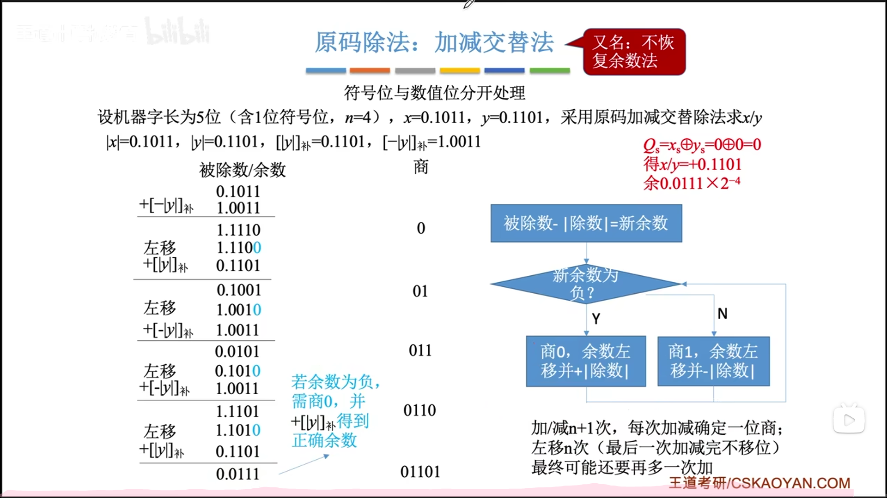
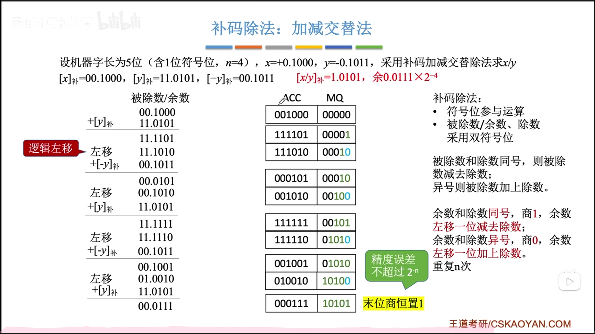

<h1>原码的一位乘法运算</h1>
符号位通过异或确定,数值位由被乘数和乘数的绝对值进行n轮加法、移位(n为数值位长度) 
每次加法可能+0、+[|x|]原 
每次移位是"逻辑右移" 
乘数的符号位不参与运算 
MQ中最低位=1时,(ACC)+[|x|]原
MQ中最低位=0时,(ACC)+0 

<h1>补码的一位乘法运算(Booth算法)</h1>
符号位、数值位都由被乘数和乘数进行n轮加法、移位,最后再多来一次加法 
每次加法可能+0、+[x]补、+[-x]补 
每次移位是"补码的算术右移" 
乘数的符号位参与运算 
t=辅助位-MQ中"最低位" , 
t=1时,(ACC)+[x]补
t=0时,(ACC)+0
t=-1时,(ACC)+[-x]补

<h1>原码除法</h1>
<h2>恢复余数法</h2>
符号位由异或得到,数值位由被除数和除数的绝对值运算得到 
实现方法: 上商0或1,得到余数,余数末尾补0  
恢复余数: 默认上商1,如果上错了,则上商0,并恢复余数  

<h2>优化--加减交替法</h2>
简化恢复余数的过程

如果最后一位为负,需要恢复余数,所以加减次数为N+1或N+2
规定:因为定点小数,被除数应当小于除数,第一位商一定是上0的,如果上1则中断除法

<h1>补码除法</h1>

最后一位恒置为1,不存在恢复余数的过程,所以加减次数为N+1

