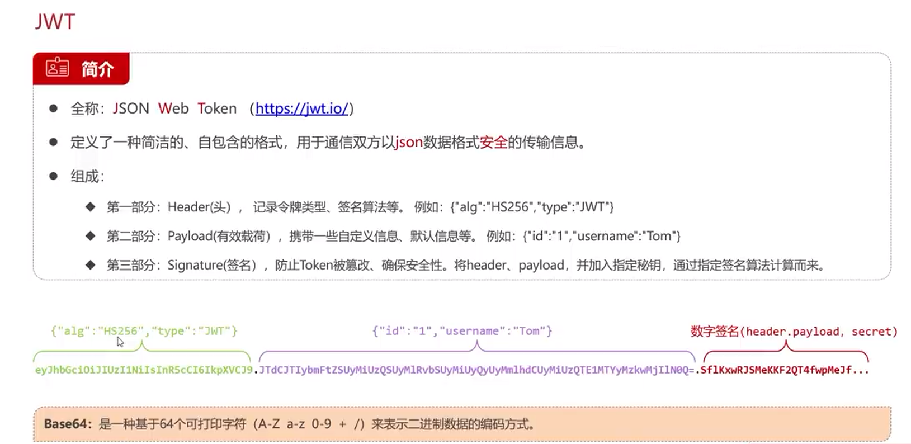

<h1>JWT (JSON Web Token)</h1>

JWT 定义了一种简洁的,自包含的格式,用于通信双方之间以 JSON 对象的形式安全的传递信息. 

JWT 通常由三部分组成: 

Header (头部) , 记录令牌类型,签名算法等.例如{"alg":"HS256","typ":"JWT"} 
Payload (负载) , 记录令牌中要传递的数据.例如{"sub":"1234567890","name":"John Doe","admin":true} 
Signature (签名) , 用于验证消息的发送者以及消息是否在传输过程中发生变化.

JWT 验证过程: 

1. 客户端发送请求到服务器,服务器根据请求生成 JWT 并返回给客户端. 
2. 客户端收到 JWWT 并存储在本地(通常使用 cookie 存储). 
3. 客户端再次发送请求到服务器,服务器验证 JWT 并返回响应. 
4. 客户端根据服务器返回的响应进行相应的操作. 

JWT 的优点: 

1. 简洁(Compact): 可以通过 URL,POST 参数或者在 HTTP header 发送,因此可以轻松通过各种 HTTP 客户端(如浏览器,mobile
   app,API)进行发送. 
2. 自包含(Self-contained): JWT 可以将信息放在一个安全且自包含的数据存储中. 
3. 安全(Secure): JWT 使用数字签名进行验证,确保数据在传输过程中未被篡改. 
4. 便携性(Portable): JWT 可以被创建和读取的任何软件使用,因此可以轻松地跨不同平台和语言使用. 
    

JWT 的缺点: 

1. 有效期短(Short-lived): JWT 的有效期通常是几分钟到几小时之间,因此不适合用于长期身份验证. 
2. 无法撤销(Unrevocable): 如果 JWT 被泄露,则无法撤销该令牌,因此可能会导致安全问题. 
3. 无法修改(Unmodifiable): JWT 一旦生成,就无法修改其内容,因此无法修改或删除其中的信息. 
4. 无法存储敏感信息(Sensitive Information): JWT 不适合存储敏感信息,例如密码或其他机密信息. 

JWT 的使用场景: 

1. 身份验证(Authentication) 
2. 信息传递(Information Transfer) 
3. 访问控制(Access Control) 
4. 会话管理(Session Management) 
5. 状态管理(State Management) 
6. 消息传递(Message Passing) 
7. 数据交换(Data Exchange) 

