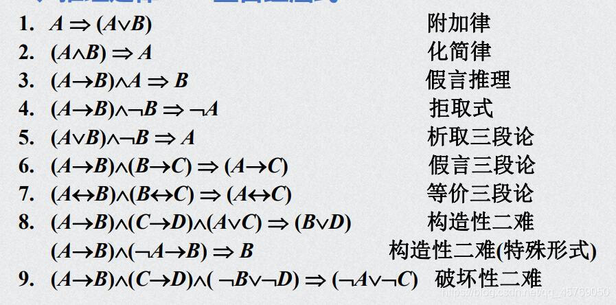

<a id="fix_a" href="#top">回到顶部</a>
<h1 id="top">谓词推理</h1>
<a href="#P10">P10 直接推理</a> 
<a href="#P11">P11 间接推理</a> 
<a href="#P12">P12 谓词逻辑</a> 
<a href="#P13">P13 谓词公式</a> 
<a href="#P14">P14 量词的符号化</a> 
<a href="#P15">P15 谓词演算的等价式与蕴涵式（1）</a> 
<a href="#P16">P16 谓词演算的等价式与蕴涵式（2）</a> 
<a href="#P17">P17 前束范式</a> 
<a href="#P18">P18 谓词演算的推理理论（1）</a> 
<a href="#P19">P19 谓词演算的推理理论（2）</a> 

<h1 id="P10">P10 直接推理（ppt1.13）</h1>
 

// 以下的写法为老书规则

P规则（引入前提规则）：在推理过程中可以随时引入前提 
T规则（引入结论规则）：在推理过程中，如果前面有一个或几个公式重言蕴涵公式S，则可将S纳入推理过程中 
推理实际上就是证明永真蕴涵的过程 
推理格式： 
第一列为步骤号，第二列为给定前提或得出的结论，第三列为注释列，标明前提还是结论，以及结论从哪几步得到、所用公式得类型 
 
例：求证P，P→Q，Q→R，则P⇒R 
# 逗号等价于合取  
证明： 
序号	前提或结论	注释列（P规则、T规则） 
（1）	P	P 
（2）	P→Q	P 
（3）	Q	T（1）（2）I 
（4）	Q→R	P 
（5）	R	T（3）（4）I 
# P=T、P→Q=T，则Q为T，又Q→R为T，则R为T 
# I为推导变换 
 
 
例2：求证¬（P∧Q）∧（Q∨R）∧¬R⇒¬P 
（1）	¬R	P 
（2）	Q∨R	P 
（3）	Q	T（1）（2）I 
（4）	¬（P∧Q）	P 
（5）	¬P∨¬Q	T（4）E 
（6）	¬P	T（3）（5）I 
#E表示等价变换 

<h1 id="P11">P11 间接推理</h1>
条件论证： 
如果要证明的结论是R→S的形式，则可把前件作为附加前提，与给定前提一起推出S。证明时写P（附加前提） 
定理（CP规则）：如果H1∧H2∧…∧Hn∧R⇒S，则H1∧H2∧…∧Hn⇒R→S 
证明： 
H1∧H2∧…∧Hn∧R⇒S 
⇔H1∧H2∧…∧Hn∧R→S 
⇔¬（H1∧H2∧…∧Hn∧R）∨S 
⇔¬（H1∧H2∧…∧Hn）∨¬R∨S 
⇔¬（H1∧H2∧…∧Hn）∨（R→S） 
⇔（H1∧H2∧…∧Hn）→（R→S） 
即H1∧H2∧…∧Hn⇒（R→S） 
 
要证明∏Hi⇒C，只要证明{Hi，¬C}是不相容的即可 
不相容定义： 
如果对Pi至少有一组赋值使H1∧H2∧…Hn为T，则公式集合{Hi}是相容的 
	 
定理：若H1∧H2∧…∧Hn∧¬C是矛盾式，则∏Hi⇒C成立 
证明： 
¬（H1∧H2∧…∧Hn∧¬C） 
⇔¬（H1∧H2∧…∧Hn）∨C 
⇔（H1∧H2∧…∧Hn）→ C 
 
反证法 
例：P→Q，（¬Q∨R）∧¬R，¬（¬P∧S）⇒¬S 
（1）	¬¬S	P（假设前提） 
（2）	S	T（1）E 
（3）	¬（¬P∧S）	P 
（4）	P∨¬S	T（3）E 
（5）	P	T（2）（4）I 
（6）	P→Q	P 
（7）	Q	T（5）（6）I 
（8）	（¬Q∨R）∧¬R	P 
（9）	¬Q∨R	T（8）I 
（10）	¬R	T（8）I 
（11）	R	T（7）（9）I 
（12）	R∧¬R	T（10）（11）I 
R∧¬R为永假 
 
 

<h1 id="P12">P12 谓词逻辑</h1>
例: 所有的金属都导电，铜是金属，所以铜导电 
谓词表达多个命题间的内部联系 
 
个体（客体）： 
个体常项：能够独立存在的具体或抽象的事物，通常用a、b、c…表示。 
例：小张、8、a、社会主义 
 
个体变元：泛指某一个个体，通常用x、y、z表示 
 
谓词： 
表达个体属性或个体之间关系的词，通常用大写字母表示 
例： 
S：是大学生，a：小张，命题：小张是大学生	可表示为S（a） 
Q：大于	，命题：3>7		可表示为Q（3，7） 
B：…在…与…之间，命题：a在b与c之间	可表示为B(a，b，c) 
 
谓词常项：表示具体性质与关系的谓词 
 
谓词变项：泛指某一性质或关系的谓词 
 
含有n个个体变元的谓词为n元谓词，P（x1,x2，…，xn） 
不带个体变元的谓词为0元谓词，如：S（a），Q（3,7） 
当谓词是常项时，0元谓词是命题，否则是变项时，0元谓词是命题变元 
 
命题函数： 
含有n个变元的命题函数是以个体域为定义域，以{F，T}为值域的n元函数 
例：A（x）：x身体好		G（x，y）：x>y 
¬A（x）→¬B（x）也是命题函数 
命题函数本身不是命题，只有在括号内填入足够的具体客体（或量词约束）后才变成命题 
 
个体域（论域）： 
个体变元的取值范围 
全总个体域：由所有个体构成的个体域（最大的个体域），对于一个命题函数，如果没有指明其个体域，则假定为全总个体域 
 
量词: 
对个体量化，例如：有些人是大学生，所有事物都是发展变化的     
    存在量词：∃，表示 “有些” “一些“ ”至少一个” 
    全称量词：∀，表示 “所有” “每个“ ”任意的” 
 
量词的指导变元： 
量词后要有一个个体变元，指明对哪个变元进行量化，则此个体变元为指导变元 
例：∀x中的x就是指导变元 
 
例1：所有的自然数都是整数 
解1：I（x）：x是整数，个体域：{自然数}，命题可写为∀x（I（x）） 
	解2：如果没设个体域，则个体域为全总个体域，要用特性谓词限定。N（x）：x是自然数（特性谓词），I（x）：x是整数，命题写为∀x（N（x）→I（x）） 
 
例2：有些大学生吸烟 
解1：A（x）：x吸烟，个体域：{大学生}	∃xA（x） 
解2：S（x）：x是大学生，A（x）：x吸烟		∃x（S（x）∧A（x）） 
	#例1的x表示所有事物，如果用合取则表示所有事物都是自然数且是整数 
	特性谓词： 
		描述个体特征的谓词，往往是给定命题中量词后面的名词 
	特性谓词的添加规则： 
		对全称量词，特性谓词常作蕴涵前件 
		对存在量词，特性谓词常作合取项 
 
例：每个人都有一个生母 
解1：M（x，y）：y是x的生母，个体域为{人}	 	
∀x∃yM（x，y） 
# x，y都是人，对于任意的x，都存在一个y，使得y是x的生母 
解2：P（x）：x是人， M（x，y）：y是x的生母 
∀x（P（x）→∃y（P（y）∧M（x，y））） 
# 对于∀的x，如果x是人，则存在y，使得y是x的生母且y也是人 
 
 

<h1 id="P13">P13 谓词公式（ppt2.3）</h1>
原子谓词公式：n元谓词P（x1，x2，…，xn）为原子谓词公式 
 
谓词合式公式： 
<ul>
<li>（1）原子谓词公式</li>
<li>（2）A、B是合式公式，则¬A、（A∧B）、（A∨B）、（A→B），（A↔B）都是合式公式</li>
<li>（3）A是合式公式，x是A中的个体变元，则∀xA和∃xA也是合式公式</li>
<li>（4）有限次运用以上条件为合式公式</li>
 
例：（P（x）∧Q）、∃x（A（x）→B(x)） 
不是合式公式的有：x∀y∃P（x）、P（∃x）∧Q（x）∀∃x 
</ul>
最外层括号可省略，量词后面的括号不可省略∃x（A（x）→B（x）） 
 
量词的作用域（辖域）：量词的作用范围 
例1：∀xA（x），∀x的辖域为A（x） 
例2：∃x（A（x）→B(x)），∃x的辖域为（A（x）→B(x)） 
例3：∀x∀y∀zA（x，y，z），∀x的辖域为∀y∀zA（x，y，z） 
 
自由变元与约束变元： 
如果客体变元x在∀x或∃x的辖域内，则x在此辖域内是约束变元，否则x是自由出现，x是自由变元 
例：∀x（F（x，y）→∃yP（y））∧Q（z） 
F（x，y）中的x是约束变元，y是自由变元 
 
几点说明： 
（1）一个n元谓词P（xi），若在前添加k个量词，使其中k个个体变元变成约束变元，则此谓词变成了n-k元谓词 
（2）一个谓词公如果没有自由变元，则为命题 
 
约束变元的换名： 
变元名有重复时，对约束变元进行换名，换为未出现过的字母 
例：∀x（F（x，y）→∃yP（y））∧Q（z） 
换名后：∀x（F（x，y）→∃tP（t））∧Q（z） 
∀x（P（x）→Q（x，y））∨R（x） 
换名后：∀z（P（z）→Q（z，y））∨R（x） 
 
自由变元的换名（代入）： 
	例：∀x（P（x）→Q（x，y））∨（R（x）∧T（x）） 
		对x代入：∀x（P（x）→Q（x，y））∨（R（z）∧T（z）） 
 
 

<h1 id="P14">P14 量词的符号化</h1>
例1：小张和小王都是运动员 
Z（x）：x是足球运动员，a：小张，b：小王，命题表示为：Z（a）∧Z（b） 
 
例2：没有不犯错误的人		⇔没有人不犯错误 
	M（x）：x是人，F（x）：x犯错误 
	有人不犯错误：∃x（M（x）∧¬F（x）） 
	没有人不犯错误：¬∃x（M（x）∧¬F（x））	¬∃表示没有 
	也等价于：所有人都要犯错误：∀x（M（x）→F（x）） 
 
例3：每个自然数都有唯一的后继数 
	A（x，y）：y是x的后继数，E（x，y）：x=y 	个体域：{自然数} 
每个自然数都有后继数：∀x∃yA（x，y） 
唯一性：∀x∃y（A（x，y）∧∀z（A（x，z）→E（y，z）））） 
#对任意的自然数x都存在y，使得y是x的后继数 
	#并且对任意的自然数z，如果z也是x的后继数，那么z和y相等（唯一性） 
 

<h1 id="P15">P15谓词演算的等价式与蕴涵式（1）（ppt2.7）</h1>
对谓词公式赋值： 
<ul>
<li>（1）指定非空个体域集合</li>
<li>（2）将命题变元用确定命题代替</li>
<li>（3）个体变元用论域中的具体个体代替</li>
<li>（4）谓词变项用谓词常项代替</li>
	例：P→N（x） 个体域：实数集R； P：2>1； N（x）：x是自然数；x=4 
		赋值: T→N（4）	真值为T 
</ul>
 
谓词公式的永真式： 
	不论对给定的谓词公式A作何种赋值，A的真值都为T，则A为永真式 
	例：I（x）∨¬I（x） 
 
等价式： 
对于谓词公式A、B，如果A↔B则A⇔B 
例：N（x）→I（x）⇔¬N（x）∨I（x） 
 
蕴涵式： 
对于谓词公式A、B，如果A→B则A⇒B 
	例：（G（x）∧N（x））⇒N（x） 
	（G（x）∧N（x））→N（x） 
⇔¬（G（x）∧N（x））∨N（x） 
⇔（¬G（x）∨¬N（x））∨N（x） 
⇔¬G（x）∨（¬N（x）∨N（x）） 
⇔T		 
 
由命题演算推广出的公式： 
	只要不牵涉量词的运算，命题演算中的等价公式和重言蕴涵公式均可推广到谓词演算中使用（一个不含自由变元的谓词公式是命题、含n个自由变元的原子谓词公式可以看作命题变元） 
 
例：A（x）⇒A（x）∨B（x）	 
∃x（A（x）→B（x））⇔∃x（¬A（x）∨B（x）） 
¬（∃xA（x）∧∃xB（x））⇔¬∃xA（x）∨¬∃xB（x） 
 
有限个体域消去量词的等价公式： 
	设论域{a1，a2，…，an}，则 
1.∀xA（x）⇔A（a1）∧A（a2）∧…∧A（an） 
2.∃xB（x）⇔B（a1）∨B（a2）∨…∨B（an） 
 
例：论域D={1，2}  
P（1，1）=P（1，2）=T，P（2，1）=P（2，2）=F 
 
例: 求∀x∃yP（y，x）的真值 
解：∀x∃yP（y，x） 
⇔∃yP（y，1）∧∃yP（y，2） 
⇔（P（1,1）∨P（2,1））∧（（P（1,2）∨P（2,2）） 
⇔（T∨F）∧（T∨F） 
⇔T 
 
 

<h1 id="P16">P16 谓词演算的等价式与蕴涵式（2）</h1>
量词否定等价公式： 
	¬∀xA（x）⇔∃x¬A（x）	  ¬∃xA（x）⇔∀x¬A（x）  量词转换律 
 

量词辖域的扩充与收缩：（ppt2.10） 
量词与“∨”“∧”的关系，仅一个运算对象A受量词约束 
 
公式1~4：∃xA（x）∧B⇔∃x（A（x）∧B）、… 

证明：∀xA（x）∨B⇔∀x（A（x）∨B） 
⇔（A（ai）∧…）∨B 
⇔（A（ai）∨B）∧… 
⇔∀x（A（x）∨B） 

公式5~6：B→∀xA（x）⇔∀x（B→A（x）） 
公式7~8：∃xA（x）→B⇔∀x（A（x）→B） 作为前件时量词变号 
 
量词的分配公式： 
	量词与“∨”“∧”的关系，其中两个运算对象均受该量词约束 
	1. ∀x（A（x）∧B（x））⇔ ∀xA（x）∧∀xB（x） 
	2. ∃x（A（x）∨B（x））⇔ ∃xA（x）∨∃xB（x） 
	3.∃x（A（x）∧B（x））⇒ ∃xA（x）∧∃xB（x） 因为这两个x可能不一致 
	4.∀xA（x）∨∀xB（x）⇒∀x（A（x）∨B（x）） 
 
其他公式： 
	5.∃x（A（x）→B（x））⇔∀xA（x）→∃xB（x） 
	6.∃xA（x）→∀xB（x）⇔∀x（A（x）→B（x）） 
	
6证明：∃xA（x）→∀xB（x） 
		⇔¬∃xA（x）∨∀xB（x） 
		⇔∀x¬A（x）∨∀xB（x） 
		⇒∀x（¬A（x）∨B（x）） 
		⇔∀x（A（x）→B（x）） 

 

<h1 id="P17">P17 前束范式（ppt2.13）</h1>
前束: 所有量词前面都没有联结词、所有量词都在公式左面、所有量词的辖域都延伸到公式末尾 
 
求前束范式步骤： 
<ul>
<li>（1）消去联结词→和↔ </li>
<li>（2）将“¬”后移（量词转化律） </li>
<li>（3）对变元换名（改名规则、代入规则） </li>
<li>（4）提取量词（量词辖域扩充公式） </li>
</ul>
例1：求∀xA（x）→∃xB（x）的前束范式 
解：	∀xA（x）→∃xB（x） 
⇔ ¬∀xA（x）∨∃xB（x） 
⇔∃x¬A（x）∨∃xB（x）⇔∃x（¬A（x）∨B（x））（量词分配公式） 
⇔∃x¬A（x）∨∃yB（y）	（变元换名） 
⇔∃x（¬A（x）∨∃yB（y））（量词辖域扩充） 
	⇔∃x∃y（¬A（x）∨B（y）） 
 
例2：求∀x（P（x）∧R（x））→（¬∃xP（x）∧Q（x））的前束范式 
	解：原式 
⇔¬∀x（P（x）∧R（x））∨（¬∃xP（x）∧Q（x）） 
⇔∃x¬（P（x）∧R（x））∨（∀x¬P（x）∧Q（x）） 
⇔∃x¬（P（x）∧R（x））∨（∀y¬P（y）∧Q（z）） 
⇔∃x∀y（（¬（P（x）∧R（x））∨（¬P（y）∧Q（z））） 
 
 

<h1 id="P18">P18 谓词演算的推理理论（1）</h1>
方法：直接论证、条件论证、反证法 
规则：P、T、US、ES、EG、UG、CP、其他 
 
US全称特指规则： 
	∀xA（x）⇒A（c）其中c是个体域内任意指定个体 
含义：如果∀xA（x）为T，则个体域内任意指定个体c，有A（c）为T 
 
ES存在特指规则： 
	∃xA（x）⇒A（c） 
	含义：如果∃xA（x）为T，则个体域内一定有一个体c，使A（c）为T 
	ES要求：此个体c不应该是用US或ES指定过的个体（让任意∀先取） 
 
EG存在推广规则： 
	A（c）⇒∃xA（x） 
	含义：如果在个体域内某个体c使A（c）为T，则∃xA（x）为T 
 
UG存在推广规则： 
	A（c）⇒∀A（x） 
	含义：如果在个体域内任意某个个体均使A（c）为T，则∀xA（x）为T 
 
例1：所有金属都导电，铜是金属，所以铜导电 
	M（x）：x是就金属，C（x）：x导电，a：铜 
前提符号化为：∀（M（x）→C（x）），M（a）⇒C（a） 
	（1）M（a）				P 
	（2）∀（M（x）→C（x））	P 
	（3）M（a）→C（a）		US（2） 
（4）C（a）				T（1）（3）I 
	 
例2：∃x（P（x）→Q（x））⇒∀xP（x）→∃xQ（x） 
条件论证法： 
（1）∀xP（x）				P（附加前提） 
（2）∃x（P（x）→Q（x））	P 
（3）P（a）→Q（a）		ES（2） 
（4）P（a）				US（1） 
（5）Q（a）				T（3）（4）I 
（6）∃xQ（x）				EG（5） 
（7）∀xP（x）→∃xQ（x）	CP 
# CP： ∃x（P（x）→Q（x））∨ ∀xP（x）	⇔∃xQ（x） 
# 则∃x（P（x）→Q（x）） ⇔ ∀xP（x）→ ∃xQ（x） 
 
反证法：（假定结论为F，然后得出一个矛盾式） 
∃x（P（x）→Q（x））⇒∀xP（x）→∃xQ（x） 
（1）¬（∀xP（x）→∃xQ（x））		P（假设前提） 
（2）¬（¬∀xP（x）∨∃xQ（x））		T（1）E 
（3）∀xP（x）∧ ¬∃xQ（x）			T（2）E 
（4）∀xP（x）					T（3）I 
（5）¬∃xQ（x）					T（3）I 
（6）∃x（P（x）→Q（x））		P 
（7）P（a）→Q（a）			ES（6） 
（8）P（a）						US（4） 
（9）Q（a）						T（7）（8）I 
（10）∃xQ（x）					EG（9） 
（11）¬∃xQ（x）∧∃xQ（x）		T（5）（10）I 
 

<h1 id="P19">P19 谓词演算的推理理论（2）</h1>
置换定律： 
	X是公式A的子公式，且X⇔Y，用Y替换A中的X得到公式B，则A⇔B 
置换定律对重言蕴涵⇒是不一定成立的，US等公式都是蕴涵式，∀必须对整个公式用这些规则，不可以对子公式用 
去量词时，该量词必须是公式最左边的量词，并且它的辖域作用到公司末尾 
 
	例1： 
错解（1）¬∀xP（x）		P			正解（1）¬∀xP（x）		P		 
	（2）¬P（c）		US（1）		（2）∃x¬P（x）		T（1）E 
	#（1）式不是∀x而是∃x				（3）¬P（c）		ES（2） 
 
例2： 
错解（1）∀x∃yP（x，y）		P		正解（1）∀x∃yP（x，y）		P	 
	（2）∀xP（x，c）		ES（1）		（2）∃yP（a，y）		US（1） 
#令P（x，y）：y是x的生母，显然（2）是F 
 
例3： 
错解 
（1）∀xP（x）→∃yQ（y）  P	 	
 
正解1 
（1）∀xP（x）→∃yQ（y）	P 
	（2）∀xP（x）→Q（b）	  ES（1）	 
	（3）P（a）→Q（b）	ES（2） 
正解2 
（1）∀xP（x）→∃yQ（y）	P 
（2）¬∀xP（x）∨∃yQ（y）	T（1）E 
（3）∃x¬P（x）∨∃yQ（y）	T（2）E 
（4）∃x∃y （¬P（x）∨Q（y））	T（3）E 
（5）∃y （¬P（a）∨Q（y））	ES（4） 
（6）¬P（a）∨Q（b）			ES（5） 
（6）P（a）→Q（b）			T（6）E 							

